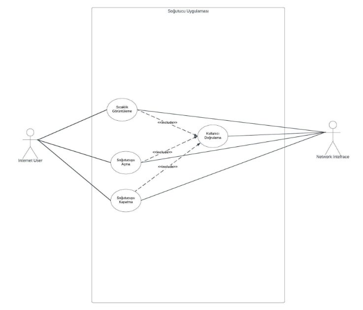
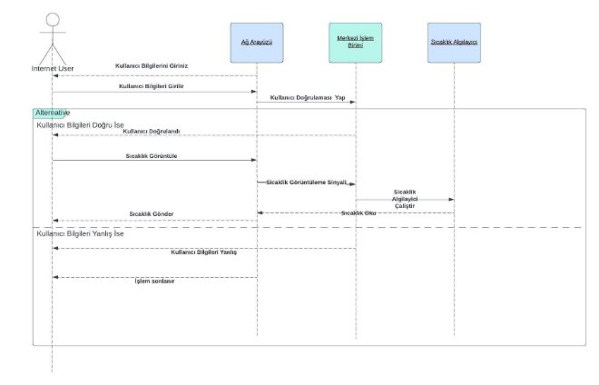
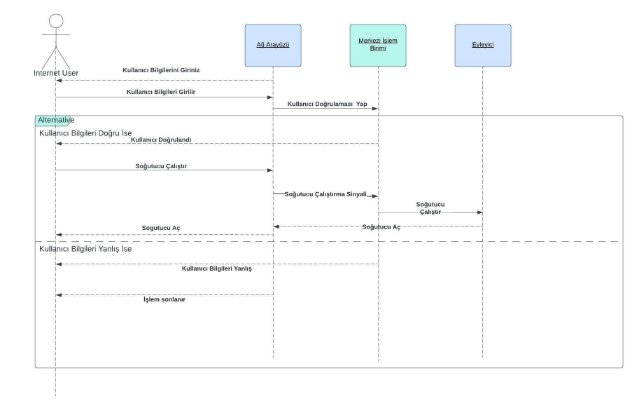
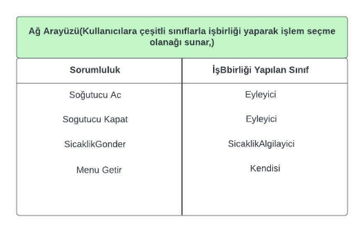
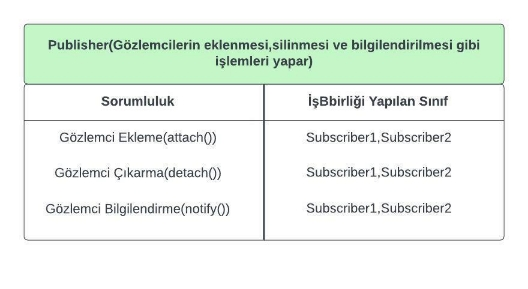
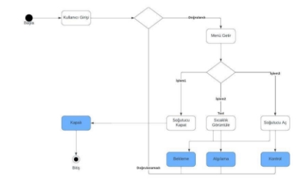
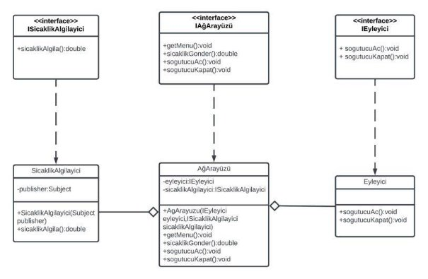
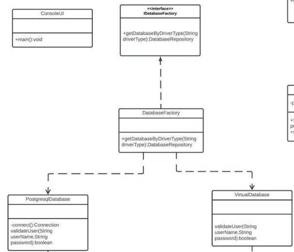
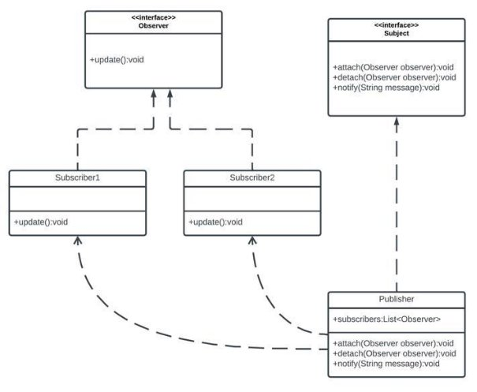

**T.C.                   SAKARYA ÜNİVERSİTESİ** 

**BİLGİSAYAR VE BİLİŞİM BİLİMLERİ FAKÜLTESİ BİLGİSAYAR MÜHENDİSLİĞİ BÖLÜMÜ** 

Nesne Yönelimli Analiz ve Tasarım Proje Raporu 

**Java ile Akıllı Soğutucu Uygulaması** 

**B201210008  - Beytullah YAYLA** 

**SAKARYA Mayıs, 2022** 

**1)İnternet Kullanıcısı İçin Use Case Diyagramı** 

**2)İnternet üzerinden “Sıcaklığın Görüntülenmesi” ve “Soğutucunun çalıştırılması ‘na ait metinsel tanımlar** 

**Hazırlayan:**Beytullah Yayla 

**Kullanım Durum Adı:**Sıcaklığın görüntülenmesi ve soğutucunun kapatılması **Tarih:**16.04.2022 

**İlgili Aktörler:**İnternet Kullanıcısı, Soğutucu Sistem** 

**Giriş Koşulu:**Kullanıcı kendisine ait bilgiler yardımıyla sisteme giriş yapar. 

**Çıkış Koşulu:**Kullanıcı işlemini tamamlar. 

**Özel Durumlar:**Sıcaklık algılayıcı çalışır durumda olmalı. Cihazımız kullanıcı tarafından 24 saat erişilebilir olmalıdır. **2.1)Ana Senaryo** 

1. Ekrana kullanıcıdan kullanıcı adı ve şifresini isteyen mesaj yazdırılır. 
1. Kullanıcı adı ve şifre kullanıcı tarafından girilir. 
1. Soğutma sistemi kullanıcının bilgilerini alır ve doğrular. 
1. Kullanıcı sistemde kayıtlı ise karşısına soğutucu aç,soğutucu kapat,sıcaklığı görüntüle, çıkış gibi seçeneklerin olduğu bir menü çıkar. 
1. Sıcaklık görüntüle işlemi bu menüden seçilir. 
1. Ortam sıcaklığı, sıcaklık algılayıcı modül ile ölçülür. 
1. Ölçülen sıcaklık merkezi işlem birimine gönderilir. 
1. Ağ arayüzü ile merkezi işlem birimine gönderilen sıcaklık bilgisi ekrana yazdırılır. 
1. Daha sonra kullanıcı karşısındaki menüden bu sefer soğutucunun çalıştrılmasını seçer. 
1. Ağ arayüzü soğutucunun açılması isteğini alır ve merkezi işlem birimine iletir. 
1. Soğutucu eyleyici yardımıyla çalıştırılır. 
1. Soğutucu açık kaldığı süre boyunca algılama modundadır. 
1. Sıcaklık istenilen seviyeye getirilir. 
1. Sistem tarafından merkezi işlem birimine istediğimiz sıcaklığa ulaştığımız hakkında sinyal gönderilir. 
1. Sıcaklığın bu şekilde devam etmesini istediğimizden sistem bekleme durumuna girer. 
1. Kullanıcı ortamın istediği sıcaklığa ulaştığını anlayınca soğutucuyu kapat seçeneğine tıklar. 
1. Ağ arayüzü soğutucuyu kapatmak için merkezi işlem birimine sinyal gönderir. 
1. Eyleyici yardımıyla soğutucu kapatılır. 
1. Soğutucunun kapandığı bilgisi ile kullanıcı bilgilendirir. 
1. Kullanıcı çıkış seçeneğine basarak uygulamadan çıkış yapar. 

**2.2)Alternatif Akış Senaryosu** 

**A1.1)Kullanıcı Doğrulaması Başarısız Oldu(3)** 

3)Kullanıcılar 3 deneme hakkına sahiptir. 3 kez yanlış giriş yapılırsa sistem sonlanır. 4)İşlem sonlandırılır. 

**A2.2)İşlem İstenilen Süre İçerisinde Seçilmedi(5)** 

6)Belirlenen sürede bir veri girişi yapılmazsa işlem sonlandırılır. 

7)İşlem sonlandırılır. 

**3)Sıcaklığın Görüntülenmesi Ve Soğutucunun Çalıştırılması Sequence  Diagram Ve Activity Diagram** 

**3.1)Sıcaklığın Görüntülenmesi Sequence Diagram** 

**3.2)Soğutucunun Açılması Sequence Diagram** 

**3.3)Activity Diagram** 

**4)UML Sınıf Şeması **

**5.CRC Kartları** 

**5.1.Ağ Arayüzü için CRC Kartı** 

**5.2.Publisher Sınıfı İçin CRC Kartı** 

**6.Akıllı Cihaz Durum Diyagramı** 

**7.Kullanıcı Doğrulama Ekranı** 

Kullanıcı adı parola kullanıcı giriş ekranında istenir.Veritabanına bağlanılır.Eğer kullanıcının girdiği bilgiler ile veritabanındaki bilgiler eşleşiyorsa kullanıcı başarılı bir şekilde giriş yapar ve işlem yapılacak menü karşısına getirilir. Bilgiler eşleşmiyorsa en fazla 3 kez olmak üzere bilgiler tekrar istenir. 3kezden fazla yanlış girilmesi durumunda işlem sonlandırılır.** 

**7.1.Başarılı Giriş** 

Kullanıcının sisteme başarıyla giriş yapması halinde karşısına işlem yapabilmesi için aşağıdaki gibi bir menü getirilir. 

**7.2.Başarısız Giriş** 

Kullanıcının sisteme yanlış bir kullanıcı adı ya da şifreyle girme girişimi sonucunda aşağıdaki gibi bir ekran alırız. Kullanıcı 3 kez yanlış giriş yaparsa otomataik olarak sistemden çıkış yapılır. 

**8.Sıcaklığın Görüntülenmesi ve Soğutucunun Açıp Kapatılmasıyla İlgili Ekran Görüntüleri** 

Kullanıcı başarılı bir şekilde giriş yaptıktan sonra karşısına gelen menüde yapmak istediği işlemi seçmelidir.Aşağıda örnek olarak seçilen işlemler ve sonuçları paylaşılmıştır. 

 

Kullanıcı adı ve şifre ile başarılı bir şekilde giriş yapıldıktan sonra 1.işlem seçildiğinde ağ arayüzü sıcaklık algılayıcı modülle haberleşerek rastgele bir değer döndürür ve ekrana basar. Bu şekilde kullanıcı bilgilendirilmiş olur. 

Kullanıcı adı ve şifre ile başarılı bir şekilde giriş yapıldıktan sonra 2.işlem seçildiğinde ise ağ arayüzü eyleyici yardımıyla soğutucuyu açar ve soğutucu açıldı mesajını ekrana basar. 

Kullanıcı adı ve şifre ile başarılı bir şekilde giriş yapıldıktan sonra 3.işlem seçildiğinde ise ağ arayüzü eyleyici yardımıyla soğutucuyu açar ve soğutucu açıldı mesajını ekrana basar. 

Kullanıcı arayüzden çıkmak istediğinde ise 4 numaralı seçeneği kullanarak sistemden çıkış yapabilir. 

**9.Veritabanındaki Users Tablosunun Görüntüsü** 

Veritabanı yönetim sistemi olarak Postgresql kullandım. Fakat sistemimiz farklı veritabanlarıyla çalışmayı mümkün hale getirmektedir. 

**10.Dependency Inversion** 

Nesneler arasındaki bağlantılarda yüksek seviyeli modül ile düşük seviyeli modül soyutlamaya bağlı olmalı.Birbirlerine arayüz üzerinden bağlı olmalılar. Üst seviyede işlem yapan metodlar alt seviyede işlem yapan metodları kullanmaktadırlar.Haliyle alt seviye metodlarda   yapılacak her değişikliğin üst seviye metodlarda da yapılması gerekir. Bu da zaman ve maliyeti epey arttırmaktadır. Dependency inversion ilkesine uyarak bu sorun ortadan kalkmış olur. Sınıflar birbirine interfaceler üzerinden bağlı olduğu için yapılan değişiklik diğer sınıfı etkilemez. Bu da bize zaman ve maliyet bakımından büyük bir avantaj sağlar.

UML Class Diagramında gördüğümüz gibi Ağ Arayüzü içerisinde Eyleyici ve SicaklikAlgilayici modüllerinin arayüzünü yani soyutunu bulundurur. Bu şekilde bağımlılık azalltılmış olur ve modülde yapılan değişiklik diğer modülü etkilemez. 

**11.Factory Design Pattern Ve Observer Design Pattern 11.1.Factory Method Nedir ve Uygulamada Nasıl Kullanılmıştır?** 

\*Nesne oluşturmayla ilgili(creational) tasarım kalıplarından biridir. 

\*Bir sınıftan nesne oluşturmak gerektiğinde, bu sorumluluğu istemci koddan ayırmak(kapsülleme/SRP) için kullanılır. 

\*Nesne oluşturmak gerektiğinde “factory method” çağırılarak nesne oluşturulur. Böylece; sınıfın bulunduğu yol/paket, istisna yönetimi gibi işlerle uğraşmaya gerek kalmaz. 

\*Nesne oluşturmayla ilgili herhangi bir değişiklikten istemci kod etkilenmez. 

Projemde bu tasarım kalıbını veritabanı nesnesini oluşturmak için kullandım. Bu metod sayesinde istediğim veritabanının nesnesini üretebiliyorum. Örneğin yönetim ekibi tarafından farklı bir veritabanı yönetim sistemi kullanma konusunda bir talep geldiğinde sistemimiz buna elverişlidir. Yapmamız gereken yeni bir class olarak ekleyip DatabaseFactory’i yeni eklenen sınıf için uygun hale getirmek olacaktır.  

Gösterdiğim diyagramın implementasyonu şekildeki gibidir. 

**11.2.Observer Design Pattern** 

Çok sayıda nesneye, gözlemledikleri nesnede meydana gelen olayı bildirmek gerektiğinde kullanılabilir. Davranışsal modellerden biridir. Örneğin mağazayaya yeni bir ürün geldiğinde ilgili müşterilere bildirim gönderilmesi, ürün indirime girdiğinde bilgi gönderilmesi bu tasarım kalıbının kullanıldığı örneklerden bazılarıdır. 

Ben kendi projemde Observer tasarım kalıbını ortam sıcaklığı 40ı geçtiği zaman kullanıcıların abonelerin bilgilendirilmesi şeklinde gerçekledim. Observer packegemda 2 adet interfacim bulunuyor. Bunlardan biri Observer, diğeri ise subject. Observer arayüzünde sıcaklığa göre abonelere mesaj yollanması için update() metodu bulunur. Subscriber1 ve Subscriber2 adındaki 2 abonemiz bu arayüzün implementasyonlarıdır. Diğer bir taraftan Subject arayüzü gözlemcilerin gözlemciler listesine eklenmesi için ekleme,çıkarma ve bilgilendirme metodlarına sahiptir. Publisher sınıfı bu arayüzün implementasyonudur. Ekleme ve çıkarma işlemleri için Observer arayüzünün implementasyonlarına bağımlıdır. 

Görüldüğü üzre sicaklikAlgila() metodunda bilgilendirilmek istenen aboneler Publisher sınıfı üzerinden bilgilendirilir.  

**12.Uygulamanın Kaynak Kodları** 

Uygulamanın kaynak kodlarına aşağıdaki github linkinden ulaşabilirsiniz. https://github.com/Beytullah-1001/Smart-Cooler-Application 
